# 🏫 Classmate - Peer Review Platform

## 📌 Project Overview
**ClassMate** is a **peer review platform** designed for students and teachers to facilitate coursework evaluations. Built with **Laravel**, it supports **role-based authentication, course management, and structured peer reviews**.  

This project follows a **secure and structured workflow**, ensuring **data validation, access control, and user-friendly navigation** using Laravel’s MVC architecture.

## 🎯 Features
- 🔐 **Role-Based Access Control (RBAC)**:
  - Students and teachers have different access levels.
  - Unauthenticated users are automatically redirected to the login page.
  - **Bulk Enrollment with Temporary Passwords**:  
    - Teachers can bulk enroll students who haven't registered yet.
    - The system **generates a temporary password**, and students must **reset their password upon first login**.
- 📚 **Course & Assessment Management**:
  - Teachers manage courses and assessments.
  - Teachers enroll students:
    - **Manual Enrollment**: Teachers select and enroll registered students into a course.
    - **Bulk Enrollment**: During course creation, teachers can upload a JSON file to enroll multiple students, including those who haven’t registered yet (assigned temporary passwords).
- ✍ **Peer Reviews**:
  - Students submit **structured** reviews for classmates.
  - Students can **rate received reviews** to highlight insightful feedback.
  - A **leaderboard ranks students** with the most highly-rated reviews to encourage engagement.
- ✅ **Teacher Grading**:
  - Teachers can **view all submitted and received reviews** per student.
  - Reviews are displayed alongside **peer ratings and scores**.
  - Teachers **assign final grades** based on peer evaluations.
  - The system supports **pagination** to efficiently manage large classes.

## 🛠 Tech Stack
- **Backend**: Laravel (MVC, Eloquent ORM)
- **Database**: MySQL (Migrations, Seeders)
- **Frontend**: Blade Templates, Bootstrap
- **Security**: CSRF Protection, Role-Based Permissions

## 📸 Preview

| 🔑 Login & Registration | 🏠 Home Page |
|-----------------|-----------|
| Unauthenticated users are automatically redirected here when trying to access any page. | Displays a list of enrolled courses. |
| 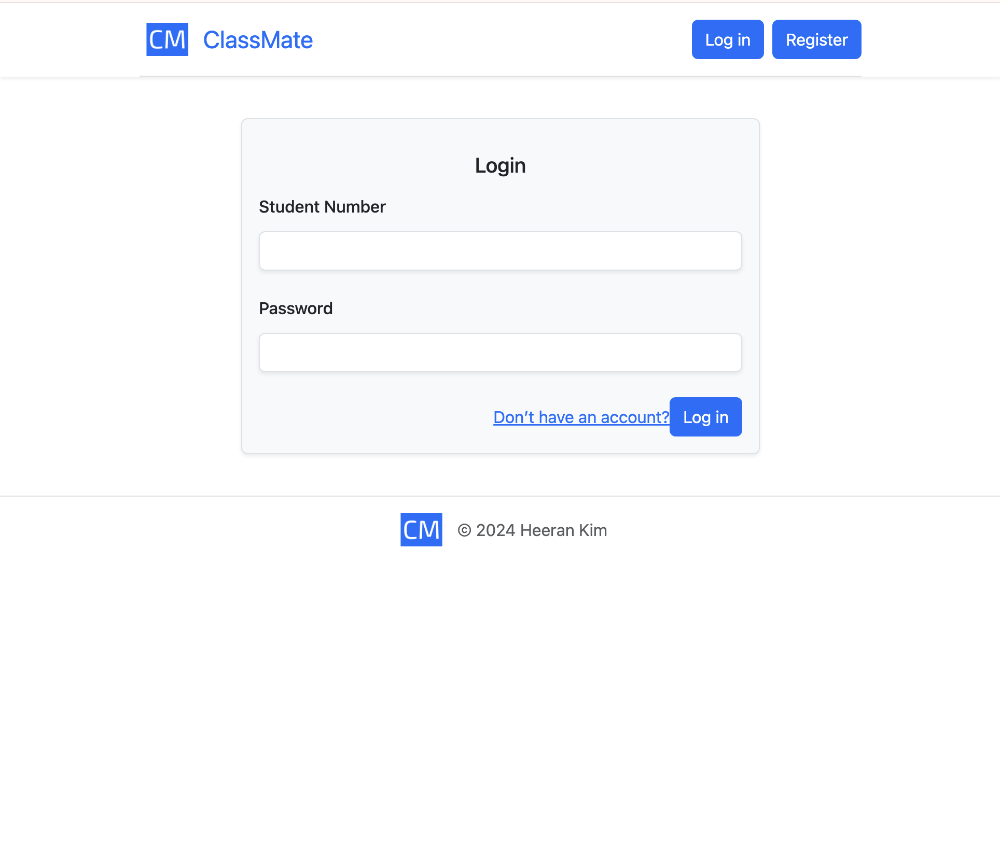 | 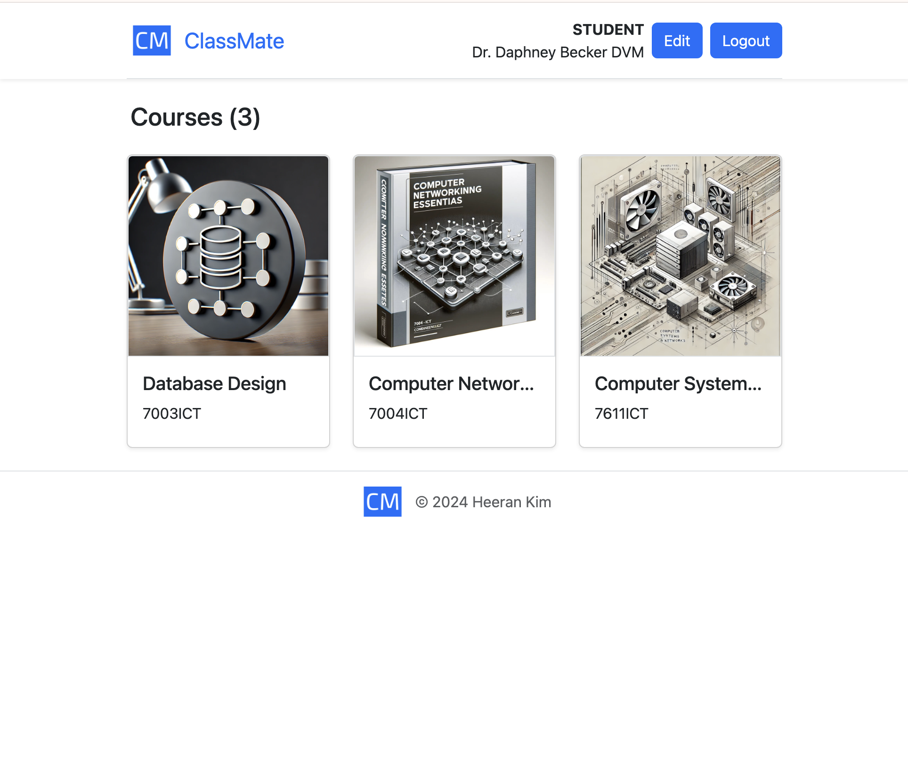 |

| 📚 Course Details (Student) | 📚 Course Details (Teacher) |
|-|-|
| Students can view course information and assessments with their scores. | Teachers can view course information, manage enrollments and create assessments. |
| 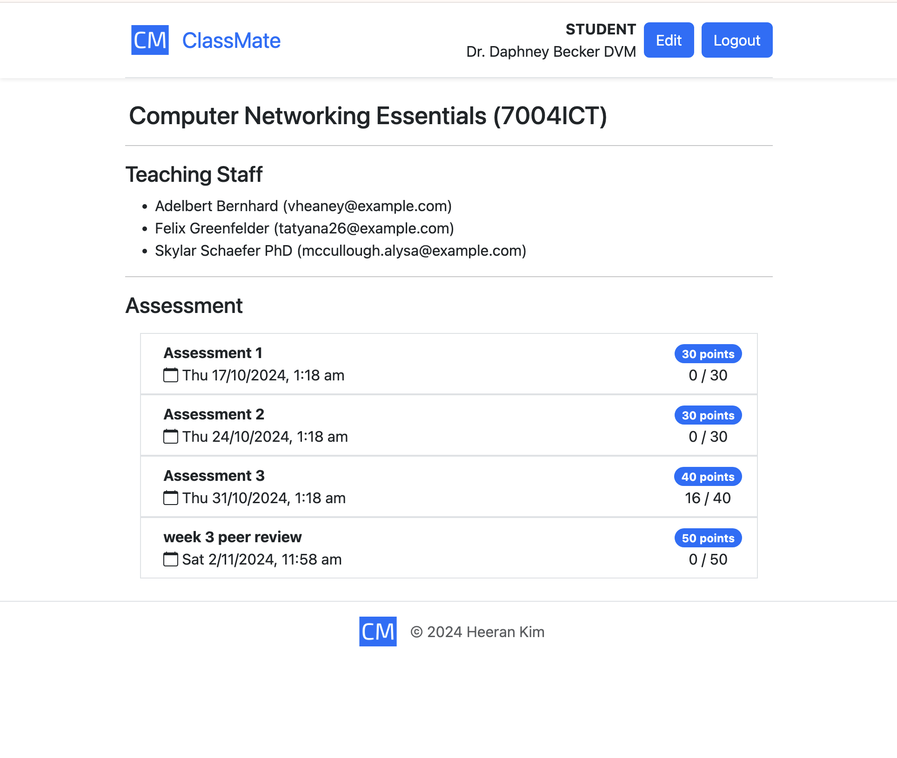 | 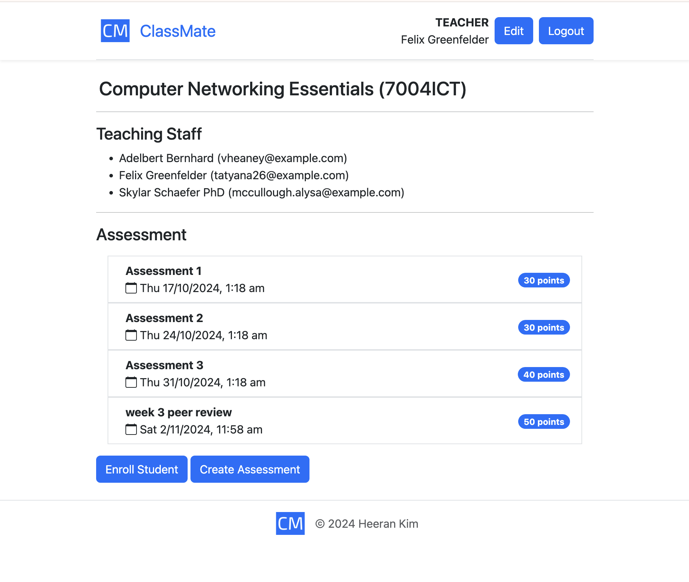 |

| 📝 Enroll Students (Teacher) | 📝 Create Assessment (Teacher) |
|-|-|
| Teachers manually enroll registered students into the course. | Teachers create new assignments with review settings. |
| 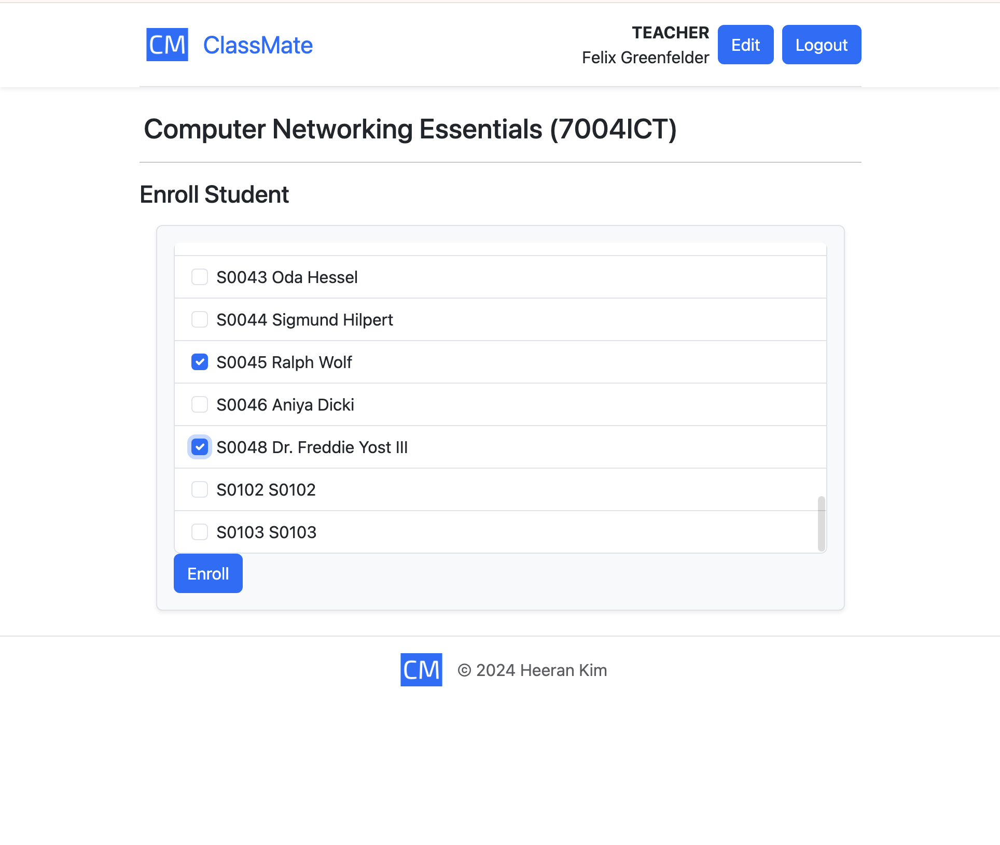 | 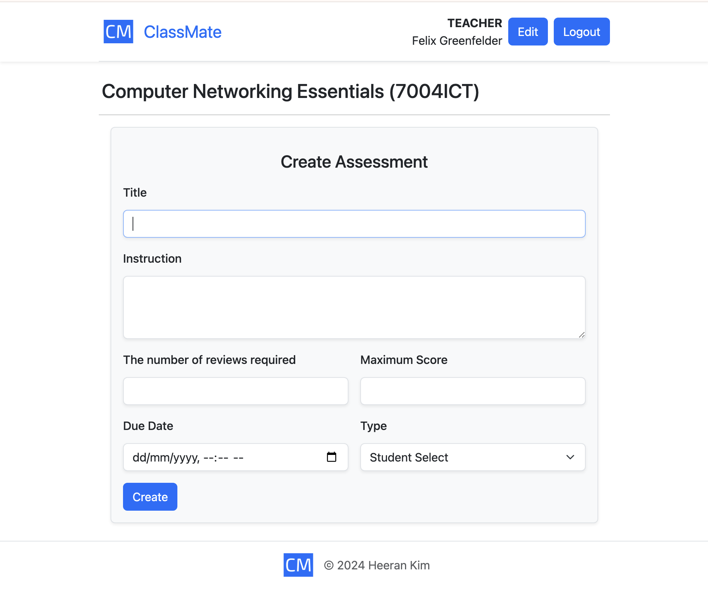 |

| 🏆 Assessment Details (Student) | 🏆 Assessment Details (Teacher) | 🏅 Scoring (Teacher) |
|-|-|-|
| Students can view submitted and received peer reviews. | Teachers can view a list of students with the number of submitted and received reviews and scores. | Teachers review all submitted and received reviews and assign final scores. |
| 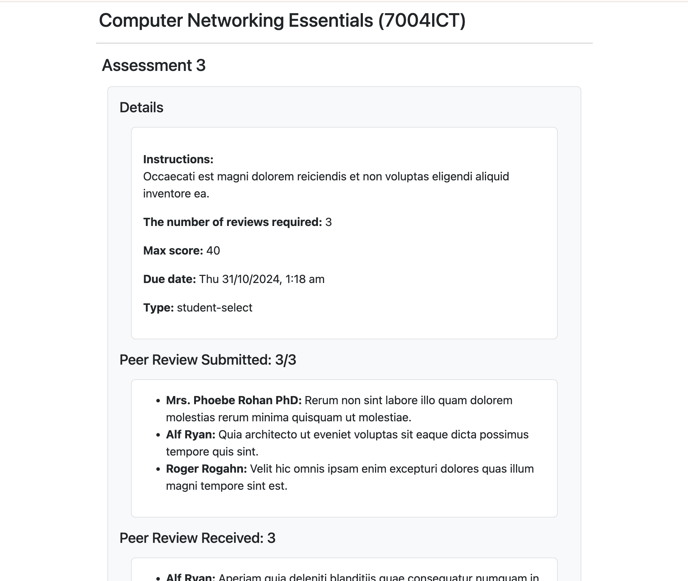 | 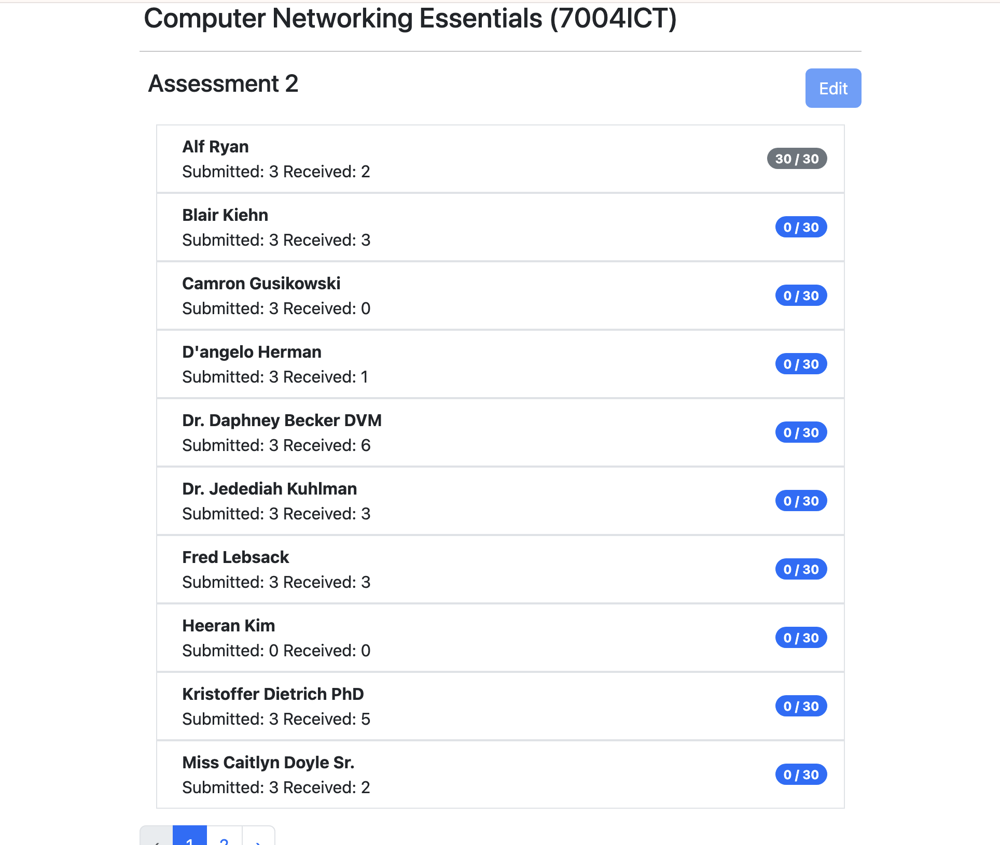 | 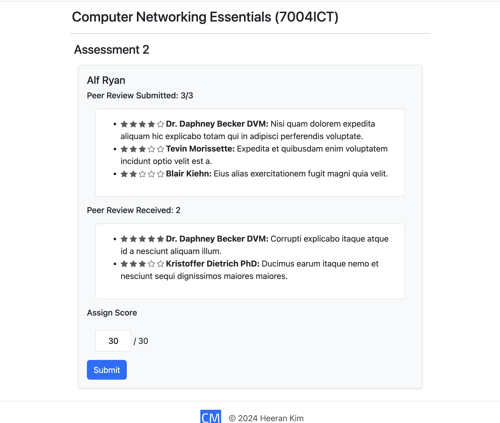 |

| ✍ Rank Received Reviews & Submit Peer Review | 🌟 Review Ranking |
|-|-|
| Students rate received reviews and provide feedback on classmates' assignments. | Highlights students with top-rated reviews. |
| 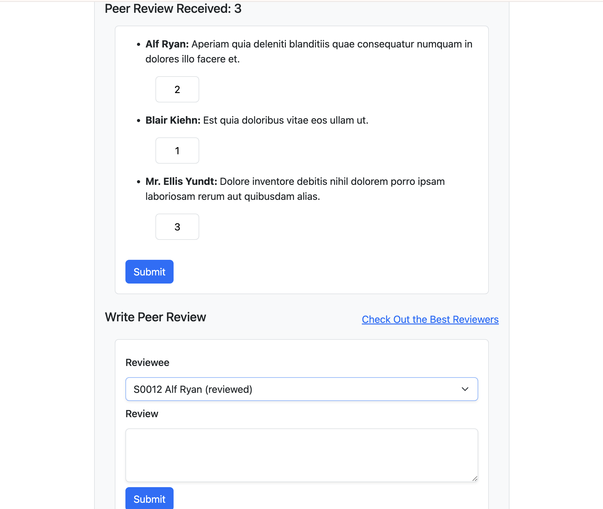 | 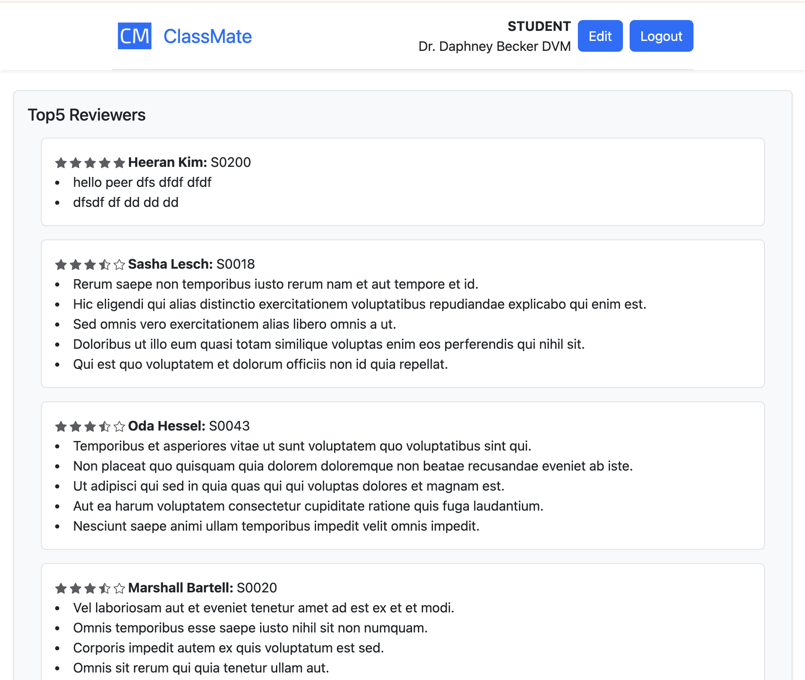 |

## 🚀 Setup & Installation

### 1️⃣ Clone the Repository
```sh
git clone https://github.com/heeran-kim/classmate-web.git
cd classmate-web
```

### 2️⃣ Install Dependencies
```sh
composer install
npm install && npm run dev
```

### 3️⃣ Set Up Environment
```sh
cp .env.example .env
php artisan key:generate
```

### 4️⃣ Run Migrations & Seed Database
```sh
php artisan migrate --seed
```

### 5️⃣ Start the Server
```sh
php artisan serve
```
Now, visit http://127.0.0.1:8000 in your browser! 🎉

--- 

### 🏆 Future Improvements
- 📊 **Enhanced Review Analytics**: AI-powered insights on review quality.
- 📈 **Reporting Dashboard**: Track student participation in peer reviews.
- 📂 **Bulk Course Uploads**: Improve processing for large-scale courses.

---

### 📜 License

This project is open-source and available under the MIT License.

---
### 🔗 Related Projects

For a property listing and review platform, check out [**EasyStay Rental Platform**](https://github.com/heeran-kim/easystay-web).